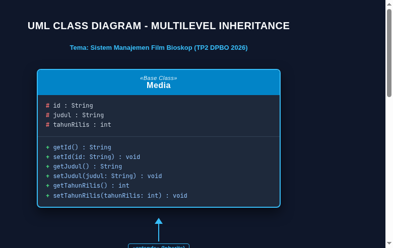
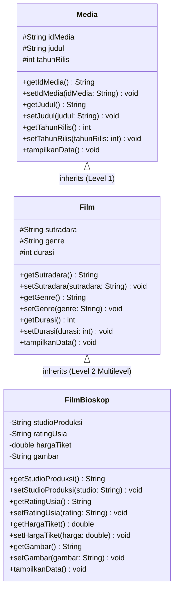
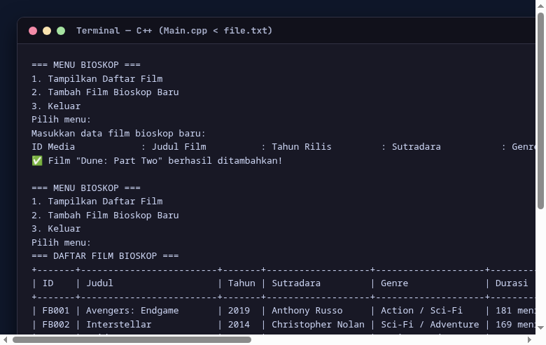
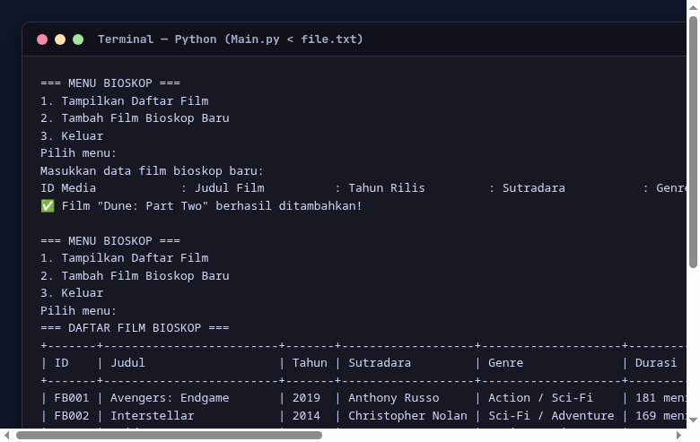
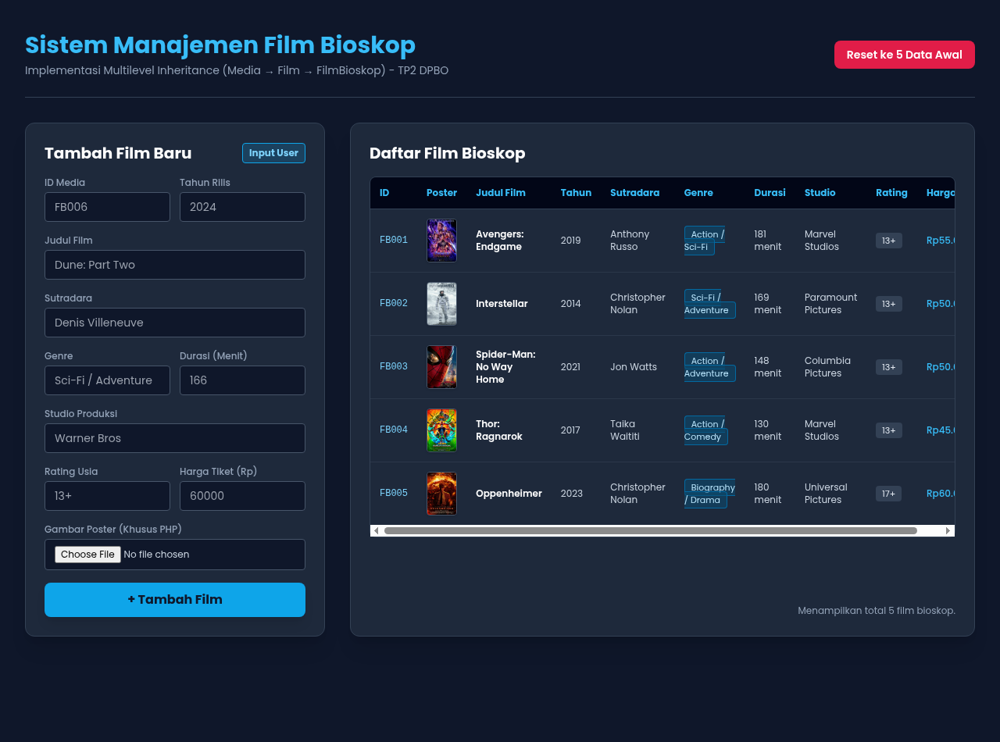
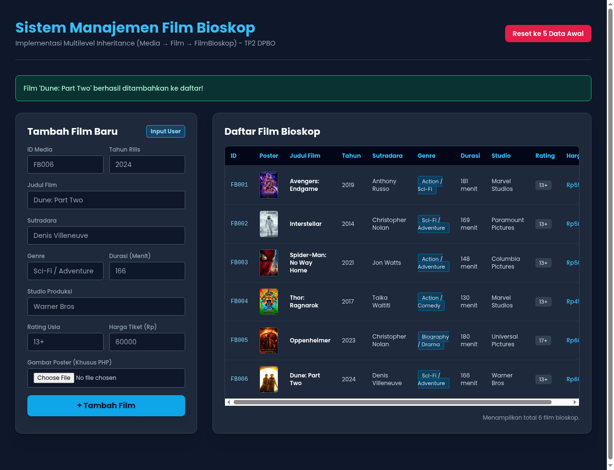

# TP2DPBO2526C1
TUGAS PRAKTIKUM 2 DPBO - MULTILEVEL INHERITANCE

## ✊🏼 JANJI
Saya Luthfi Naufal Alfareza dengan NIM 2511437 mengerjakan Tugas Praktikum 2 dalam mata kuliah Desain dan Pemrograman Berorientasi Objek (DPBO) untuk keberkahan-Nya maka saya tidak akan melakukan kecurangan seperti yang telah dispesifikasikan. Aamiin.

---

## 👾 DESCRIPTION
Program ini mengimplementasikan konsep **Multilevel Inheritance (Pewarisan Bertingkat)** dalam kasus **Sistem Manajemen Film Bioskop** pada Object-Oriented Programming (OOP) yang dikembangkan dari tema TP1.

Terdapat 3 class berjenjang dengan masing-masing minimal 3 atribut:
1. **`Media`**: Base class yang memiliki atribut paling umum dari sebuah karya media rekam.
2. **`Film`**: Turunan dari class `Media` (Inheritance Level 1), menambahkan atribut yang spesifik dimiliki oleh karya perfilman layar lebar.
3. **`FilmBioskop`**: Turunan dari class `Film` (Inheritance Level 2), menambahkan atribut khusus untuk penayangan dan distribusi komersial film di bioskop.

Program dibuat dalam 4 bahasa pemrograman:
- **C++**
- **Java**
- **Python**
- **PHP** (dengan GUI Web berbasis Tailwind CSS + mode CLI)

**Ketentuan yang dipenuhi:**
- Memiliki 5 data objek awal default sebelum input user.
- Menerima input user untuk menambah data baru (*Add Saja*).
- Menampilkan seluruh data dari setiap class di dalam **SATU TABEL** secara lengkap dan dinamis.
- Pada PHP ditambahkan atribut gambar poster (`images/`).
- Disertakan file testcase input `file.txt` di setiap bahasa.

---

## ❌ Error Handling
Pada seluruh program di keempat bahasa, diterapkan penanganan kesalahan (*error handling*) yang komprehensif:
1. **Validasi ID Unik**: Program memeriksa apakah ID media yang diinputkan sudah terdaftar dalam sistem. Jika ID sudah ada, program menolak dan meminta pengguna memasukkan ID lain.
2. **Validasi Angka Positif**: Nilai numerik seperti tahun rilis, durasi film (menit), dan harga tiket bioskop divalidasi harus berupa angka positif yang valid.
3. **Input Buffer Safety**: Pada C++ dan Java, penanganan kesalahan pembacaan tipe data (non-numeric input pada integer/double) ditangani dengan pembersihan buffer (`cin.clear()`, `cin.ignore()`, `scanner.nextLine()`) untuk mencegah loop tak terbatas (*infinite loop*).

---

## 📊 Diagram Konsep:

<p align="center">
  
</p>



### Alasan Pemilihan Class:
1. **`Media`**: Merupakan entitas paling umum dalam industri hiburan rekam, mencakup ID, Judul, dan Tahun Rilis.
2. **`Film`**: Kategori yang lebih khusus dari media, merepresentasikan karya audiovisual berdurasi waktu tertentu yang memiliki sutradara dan genre.
3. **`FilmBioskop`**: Entitas turunan bertingkat paling spesifik yang merepresentasikan film yang ditayangkan di gedung bioskop komersial dengan studio produksi/distributor, klasifikasi rating usia penonton, harga tiket, dan poster promosi.

---

## ☕ Class & Atribut

### 1. `Media` (Base Class)
- `idMedia` : string (ID unik media)
- `judul` : string (Judul film/media)
- `tahunRilis` : int (Tahun rilis ke publik)

### 2. `Film` (extends `Media`)
- `sutradara` : string (Nama sutradara)
- `genre` : string (Genre karya film)
- `durasi` : int (Panjang film dalam satuan menit)

### 3. `FilmBioskop` (extends `Film`)
- `studioProduksi` : string (Rumah produksi / distributor film)
- `ratingUsia` : string (Klasifikasi batasan usia: SU, 13+, 17+, 21+)
- `hargaTiket` : double (Harga tiket nonton reguler bioskop dalam Rupiah)
- `gambar` : string (**Khusus PHP**, file poster film di folder `images/`)

---

## 🏁 Alur Program
1. **Inisialisasi Data Default**: Program secara otomatis memuat 5 data objek awal bioskop (Avengers: Endgame, Interstellar, Spider-Man: No Way Home, Thor: Ragnarok, Oppenheimer).
2. **Menu Interaktif**: Pengguna disajikan menu pilihan:
   - `1. Tampilkan Daftar Film`: Menampilkan seluruh data dari ke-3 class di dalam satu tabel dinamis.
   - `2. Tambah Film Bioskop Baru`: Menerima input data baru dari user dengan validasi ketat.
   - `3. Keluar`: Mengakhiri program.
3. **Tabel Dinamis**: Lebar tiap kolom tabel dihitung dinamis sesuai panjang karakter terpanjang data.
4. **Otomatisasi Testcase**: Disediakan `file.txt` pada masing-masing bahasa untuk pengujian instan via input redirection (`< file.txt`).
5. **Fitur Web PHP**: Pada PHP disediakan form input interaktif, upload file gambar poster ke direktori `images/`, dan tombol *Reset Data* untuk mengembalikan session ke 5 data default awal.

---

## 📷 Dokumentasi

### C++
<p align="center">
  
</p>

### Java
<p align="center">
  
</p>

### Python
<p align="center">
  
</p>

### PHP
- **Tampilan Web 5 Data Awal:**
<p align="center">
  
</p>

- **Tampilan Web Setelah Tambah Data:**
<p align="center">
  
</p>

- **Eksekusi Mode CLI PHP:**
<p align="center">
  
</p>

---

## 🚀 Cara Menjalankan Program

### C++
```bash
cd CPP
g++ -std=c++11 Main.cpp -o main
./main < file.txt   # Menggunakan testcase otomatis
# Atau jalankan interaktif:
./main
```

### Java
```bash
cd Java
javac *.java
java Main < file.txt   # Menggunakan testcase otomatis
# Atau jalankan interaktif:
java Main
```

### Python
```bash
cd Python
python3 Main.py < file.txt   # Menggunakan testcase otomatis
# Atau jalankan interaktif:
python3 Main.py
```

### PHP
- **Mode CLI (Terminal):**
  ```bash
  cd PHP
  php Main.php < file.txt
  ```
- **Mode Web (Browser):**
  ```bash
  cd PHP
  php -S localhost:8000
  ```
  Buka browser pada `http://localhost:8000`.
