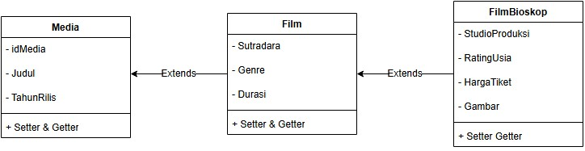
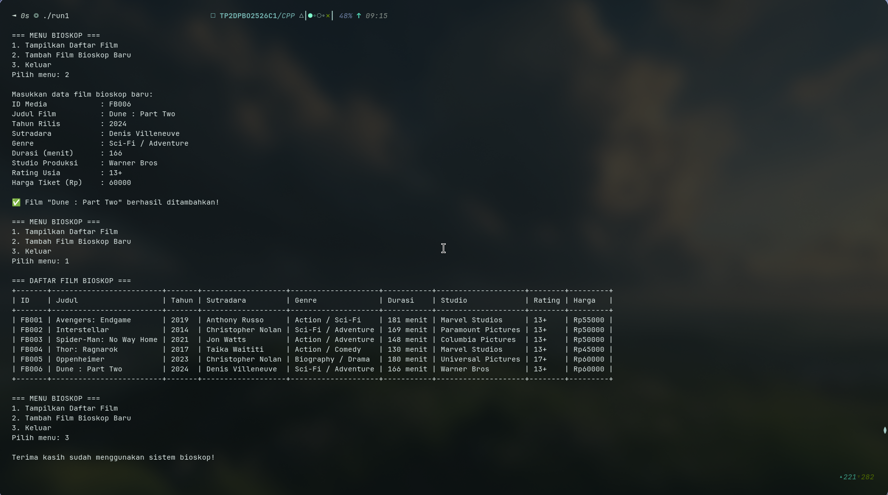
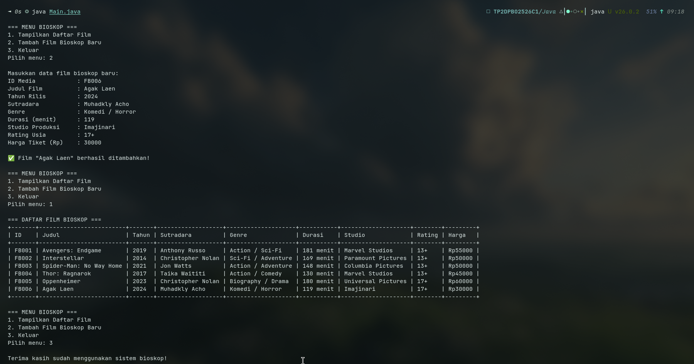
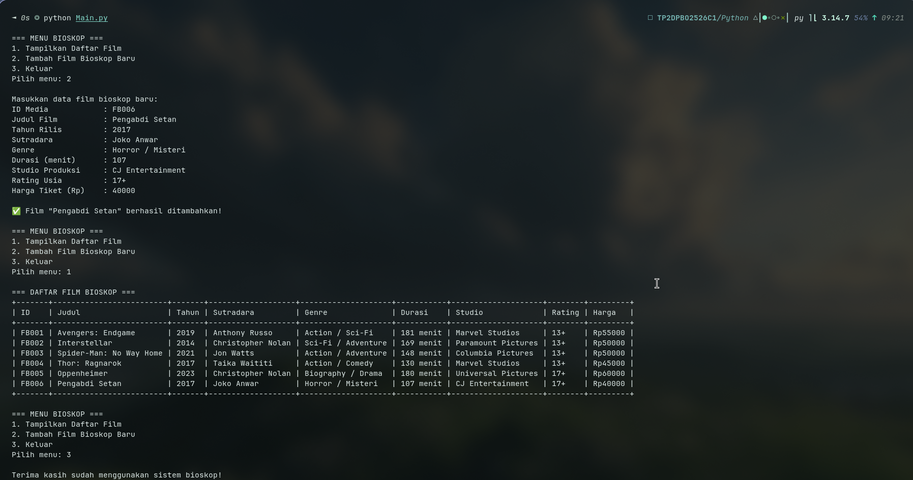
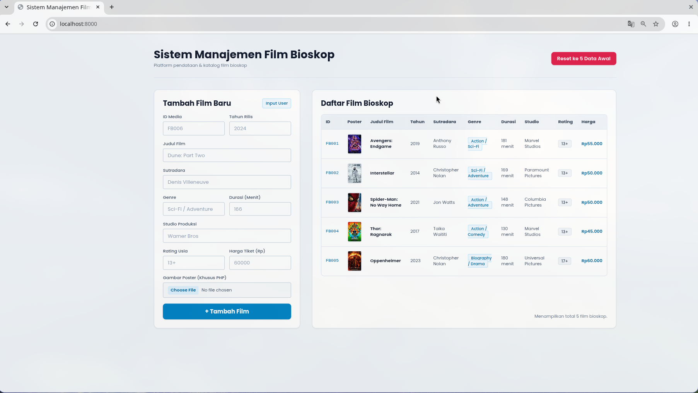

## JANJI
Saya Luthfi Naufal Alfareza dengan NIM 2511437 mengerjakan Tugas Praktikum 2 dalam mata kuliah Desain dan Pemrograman Berorientasi Objek untuk keberkahan-Nya maka saya tidak akan melakukan kecurangan seperti yang telah dispesifikasikan. Aamiin.

## Struktur File
```
TP2DPBO2526C1
├── CPP
│   ├── FilmBioskop.cpp
│   ├── Film.cpp
│   ├── input.txt
│   ├── Main.cpp
│   └── Media.cpp
|
├── Java
│   ├── FilmBioskop.java
│   ├── Film.java
│   ├── input.txt
│   ├── Main.java
│   └── Media.java
|
├── PHP
│   ├── images
│   │   ├── avengers_endgame.jpg
│   │   ├── dune_part_two.jpg
│   │   ├── interstellar.jpg
│   │   ├── oppenheimer.jpg
│   │   ├── spiderman_brand_new_day.jpg
│   │   └── thor_ragnarok.jpg
│   ├── FilmBioskop.php
│   ├── Film.php
│   ├── index.php
│   ├── input.txt
│   ├── Main.php
│   └── Media.php
|
├── Python
│   ├── FilmBioskop.py
│   ├── Film.py
│   ├── input.txt
│   ├── Main.py
│   └── Media.py
|
├── Dokumentasi
│   ├── CPP
│   │   └── image.png
│   ├── Java
│   │   └── image.png
│   ├── PHP
│   │   ├── image copy.png
│   │   └── image.png
│   └── Python
│       └── image.png
|
├── diagram.jpg
├── README.md
```
## Diagram:

<p align="center">
  
</p>

### Alasan Pemilihan Class:
1. **`Media`**: Merupakan entitas paling umum dalam industri hiburan rekam, mencakup ID, Judul, dan Tahun Rilis.
2. **`Film`**: Kategori yang lebih khusus dari media, merepresentasikan karya audiovisual berdurasi waktu tertentu yang memiliki sutradara dan genre.
3. **`FilmBioskop`**: Entitas turunan bertingkat paling spesifik yang merepresentasikan film yang ditayangkan di gedung bioskop komersial dengan studio produksi/distributor, klasifikasi rating usia penonton, harga tiket, dan poster promosi.

---

## ☕ Class, Atribut, & Methods

### 1. `Media` (Base Class)
- **Atribut:**
  - `idMedia` : string (ID unik media)
  - `judul` : string (Judul film/media)
  - `tahunRilis` : int (Tahun rilis ke publik)
- **Methods:**
  - `getIdMedia()` / `setIdMedia(string)` : Mengambil dan mengubah ID media.
  - `getJudul()` / `setJudul(string)` : Mengambil dan mengubah judul karya media.
  - `getTahunRilis()` / `setTahunRilis(int)` : Mengambil dan mengubah tahun rilis media.
  - `tampilkanData()` : Menampilkan ringkasan data entitas media ke konsol/layar.

### 2. `Film` (extends `Media`)
- **Atribut:**
  - `sutradara` : string (Nama sutradara film)
  - `genre` : string (Genre karya perfilman)
  - `durasi` : int (Panjang durasi film dalam satuan menit)
- **Methods:**
  - `getSutradara()` / `setSutradara(string)` : Mengambil dan mengubah nama sutradara.
  - `getGenre()` / `setGenre(string)` : Mengambil dan mengubah genre film.
  - `getDurasi()` / `setDurasi(int)` : Mengambil dan mengubah durasi film (menit).
  - `tampilkanData()` : Menampilkan data film dengan terlebih dahulu memanggil `tampilkanData()` milik class parent `Media`.

### 3. `FilmBioskop` (extends `Film`)
- **Atribut:**
  - `studioProduksi` : string (Rumah produksi / distributor penayangan bioskop)
  - `ratingUsia` : string (Klasifikasi batasan usia penonton, misal: SU, 13+, 17+, 21+)
  - `hargaTiket` : double (Harga tiket nonton reguler bioskop dalam Rupiah)
  - `foto_produk` / `gambar` : string (**Khusus PHP**, path/nama file poster film di folder `images/`)
- **Methods:**
  - `getStudioProduksi()` / `setStudioProduksi(string)` : Mengambil dan mengubah studio produksi bioskop.
  - `getRatingUsia()` / `setRatingUsia(string)` : Mengambil dan mengubah batas klasifikasi usia.
  - `getHargaTiket()` / `setHargaTiket(double)` : Mengambil dan mengubah nominal harga tiket nonton.
  - `getFotoProduk()` / `setFotoProduk(string)` (*khusus PHP*) : Mengambil dan mengubah nama file poster produk.
  - `tampilkanData()` : Menampilkan seluruh data lengkap penayangan bioskop secara berjenjang melalui pemanggilan method parent.


---

## Alur Program
1. **Inisialisasi Data Default**: Program secara otomatis memuat 5 data objek awal bioskop (Avengers: Endgame, Interstellar, Spider-Man: No Way Home, Thor: Ragnarok, Oppenheimer).
2. **Menu Interaktif**: Pengguna disajikan menu pilihan:
   - `1. Tampilkan Daftar Film`: Menampilkan seluruh data dari ke-3 class di dalam satu tabel dinamis.
   - `2. Tambah Film Bioskop Baru`: Menerima input data baru dari user dengan validasi ketat.
   - `3. Keluar`: Mengakhiri program.
3. **Tabel Dinamis**: Lebar tiap kolom tabel dihitung dinamis sesuai panjang karakter terpanjang data.
4. **Otomatisasi Testcase**: Disediakan `input.txt` pada masing-masing bahasa untuk pengujian instan via input redirection (`< input.txt`).
5. **Fitur Web PHP**: Pada PHP disediakan form input interaktif, upload file gambar poster ke direktori `images/`, dan tombol *Reset Data* untuk mengembalikan session ke 5 data default awal.

---

## Dokumentasi

### C++
---
<p align="center">
  
</p>

### Java
---
<p align="center">
  
</p>

### Python
---
<p align="center">
  
</p>

### PHP
---
- **Tampilan Web 5 Data Awal:**
<p align="center">
  
</p>

- **Tampilan Web Setelah Tambah Data:**
<p align="center">
  
</p>
