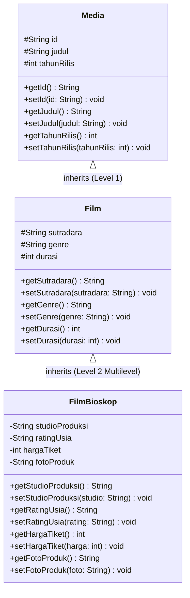

# Janji
Saya Luthfi Naufal Alfareza dengan NIM 2511437 mengerjakan Tugas Praktikum 2 pada Mata Kuliah Desain dan Pemrograman Berorientasi Objek (DPBO) untuk keberkahan-Nya maka saya tidak melakukan kecurangan seperti yang telah dispesifikasikan. Aamiin.

---

# Struktur File Repository

```
TP2DPBO2526C1/
├── CPP/
│   ├── Media.hpp
│   ├── Film.hpp
│   ├── FilmBioskop.hpp
│   ├── main.cpp
│   └── file.txt
├── Java/
│   ├── Media.java
│   ├── Film.java
│   ├── FilmBioskop.java
│   ├── Main.java
│   └── file.txt
├── Python/
│   ├── media.py
│   ├── film.py
│   ├── film_bioskop.py
│   ├── main.py
│   └── file.txt
├── PHP/
│   ├── Media.php
│   ├── Film.php
│   ├── FilmBioskop.php
│   ├── index.php
│   ├── file.txt
│   └── image/
│       ├── avengers_endgame.jpg
│       ├── dune_part_two.jpg
│       ├── interstellar.jpg
│       ├── oppenheimer.jpg
│       ├── spiderman_brand_new_day.jpg
│       └── thor_ragnarok.jpg
├── Dokumentasi/
│   ├── design_diagram.png
│   ├── cpp_output.png
│   ├── java_output.png
│   ├── python_output.png
│   ├── php_awal.png
│   ├── php_tambah.png
│   └── php_cli_output.png
├── soal.txt
└── README.md
```

---

# Desain & Diagram Kelas (Multilevel Inheritance)

Program ini merupakan pengembangan dari tema TP1 (**Film**) dengan menerapkan konsep **OOP Multilevel Inheritance (Pewarisan Bertingkat)** yang mencerminkan objek di dunia nyata.

Sistem terdiri dari **3 class** berjenjang dengan masing-masing minimal 3 atribut:
1. **`Media`** (Base Class)
2. **`Film`** (Subclass turunan dari `Media`)
3. **`FilmBioskop`** (Subclass turunan dari `Film`)

### Design Diagram (UML Class Diagram)

<p align="center">
  
</p>



---

# Penjelasan Atribut dan Methods

### 1. Base Class: `Media`
Merepresentasikan entitas umum karya rekam/media digital.
- **Atribut:**
  - `id` (String): ID unik penanda karya media (misal: `"FB01"`).
  - `judul` (String): Judul karya media.
  - `tahunRilis` (int): Tahun peluncuran/rilis karya ke publik.
- **Methods:**
  - Constructor (default & parameterized): Menginisialisasi nilai atribut awal.
  - Getter & Setter untuk setiap atribut (`getId`, `setId`, `getJudul`, `setJudul`, `getTahunRilis`, `setTahunRilis`).

### 2. Subclass Level 1: `Film` (extends `Media`)
Mewarisi `Media`, menambahkan detail teknis produksi perfilman.
- **Atribut:**
  - `sutradara` (String): Nama sutradara penanggung jawab produksi kreatif film.
  - `genre` (String): Kategori tema film (misal: `"Action / Sci-Fi"`).
  - `durasi` (int): Panjang durasi film dalam satuan menit.
- **Methods:**
  - Constructor (default & parameterized): Memanggil constructor super/parent class `Media`.
  - Getter & Setter untuk setiap atribut (`getSutradara`, `setSutradara`, `getGenre`, `setGenre`, `getDurasi`, `setDurasi`).

### 3. Subclass Level 2: `FilmBioskop` (extends `Film`)
Mewarisi `Film` (dan secara tidak langsung mewarisi `Media`), merepresentasikan film yang didistribusikan secara komersial untuk penayangan di bioskop.
- **Atribut:**
  - `studioProduksi` (String): Rumah produksi atau distributor resmi (misal: `"Marvel Studios"`, `"Warner Bros"`).
  - `ratingUsia` (String): Batasan klasifikasi usia penonton bioskop (misal: `"SU"`, `"13+"`, `"17+"`).
  - `hargaTiket` (int): Harga rata-rata tiket penayangan reguler di bioskop dalam Rupiah.
  - `fotoProduk` (String, **Khusus PHP**): Nama file gambar poster film yang tersimpan pada folder `image/`.
- **Methods:**
  - Constructor (default & parameterized): Memanggil constructor super/parent class `Film`.
  - Getter & Setter untuk setiap atribut (`getStudioProduksi`, `setStudioProduksi`, `getRatingUsia`, `setRatingUsia`, `getHargaTiket`, `setHargaTiket`, serta `getFotoProduk` & `setFotoProduk` di PHP).

---

# Penjelasan Alur Program

1. **Inisialisasi 5 Objek Awal:**
   Pada saat program pertama kali dijalankan, program langsung menginisialisasi 5 objek `FilmBioskop` di dalam list/array/vector secara otomatis (Avengers: Endgame, Interstellar, Spider-Man: No Way Home, Thor: Ragnarok, Oppenheimer).
2. **Penampilan Tabel Awal (Tabel Dinamis):**
   Program menampilkan ke-5 objek awal di dalam **satu tabel lengkap** yang memuat seluruh atribut dari ketiga level class (ID, Judul, Tahun, Sutradara, Genre, Durasi, Studio, Rating, Harga Tiket, serta Poster di PHP). Lebar tiap kolom tabel dihitung secara dinamis menyesuaikan panjang teks data terpanjang.
3. **Menerima Input User (Add Saja):**
   Program meminta masukan dari user mengenai berapa data film baru yang ingin ditambahkan. Jika lebih dari 0, program menerima masukan bertahap untuk mengisi seluruh field objek `FilmBioskop` baru dan menambahkannya ke dalam koleksi data.
4. **Penampilan Tabel Akhir:**
   Setelah proses input selesai, program kembali merender tabel dinamis lengkap yang telah terbarukan dengan seluruh data awal ditambah data yang baru saja diinputkan oleh user.
5. **Dukungan Testcase (`file.txt`):**
   Setiap folder bahasa memiliki berkas `file.txt` yang berisi data input uji otomatis yang dapat dialirkan via stdin/redirection (contoh: `./main < file.txt`).

---

# Dokumentasi Eksekusi Program

## 1. C++ (CPP)
Eksekusi program C++ menggunakan input testcase `file.txt`:
<p align="center">
  
</p>

## 2. Java
Eksekusi program Java menggunakan input testcase `file.txt`:
<p align="center">
  
</p>

## 3. Python
Eksekusi program Python menggunakan input testcase `file.txt`:
<p align="center">
  
</p>

## 4. PHP
### Tampilan Web (Browser)
- **Tampilan 5 Objek Awal & Form Tambah Data:**
<p align="center">
  
</p>

- **Tampilan Setelah User Menambah Data Baru:**
<p align="center">
  
</p>

### Mode CLI PHP
Dapat dieksekusi langsung via terminal menggunakan `php index.php < file.txt`:
<p align="center">
  
</p>

---

# Cara Menjalankan Program

### C++
```bash
cd CPP
g++ -std=c++11 main.cpp -o main
./main < file.txt   # Menggunakan testcase otomatis
# Atau jalankan interaktif:
./main
```

### Java
```bash
cd Java
javac *.java
java Main < file.txt   # Menggunakan testcase otomatis
# Atau jalankan interaktif:
java Main
```

### Python
```bash
cd Python
python3 main.py < file.txt   # Menggunakan testcase otomatis
# Atau jalankan interaktif:
python3 main.py
```

### PHP
- **Melalui Terminal (CLI):**
  ```bash
  cd PHP
  php index.php < file.txt
  ```
- **Melalui Browser (Web Server Lokal):**
  ```bash
  cd PHP
  php -S localhost:8000
  ```
  Buka browser dan akses `http://localhost:8000`.
